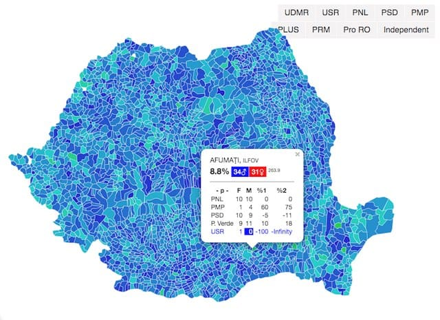

[statistici-electorale.github.io/sexul-candidatilor/](https://statistici-electorale.github.io/sexul-candidatilor/) 

Verificarea respectării regulii de reprezentare a ambelor sexe pe listele electorale: [Legea 115/2015](http://legislatie.just.ro/Public/DetaliiDocument/168136#id_artA49), [Legea 208/2015](http://legislatie.just.ro/Public/DetaliiDocument/170037#id_artA489_bdy) la Alegerile Locale din 2020

> Listele de candidați pentru alegerea consiliilor locale și a consiliilor județene / senatorilor şi deputaţilor trebuie întocmite astfel încât să asigure reprezentarea ambelor sexe, cu excepția acelora care conțin un singur candidat.

uses [pax/ro-gender-assumer](https://github.com/pax/ro-gender-assumer) 

 ă